This application does everything I liked about Facebook before deactivating my account - it tracks RSVPs to my parties.

Developed using React with Redux and Sagas, Node & Express, PostgreSQL, and a lil MUI.

## Guest Views

Initial landing view:
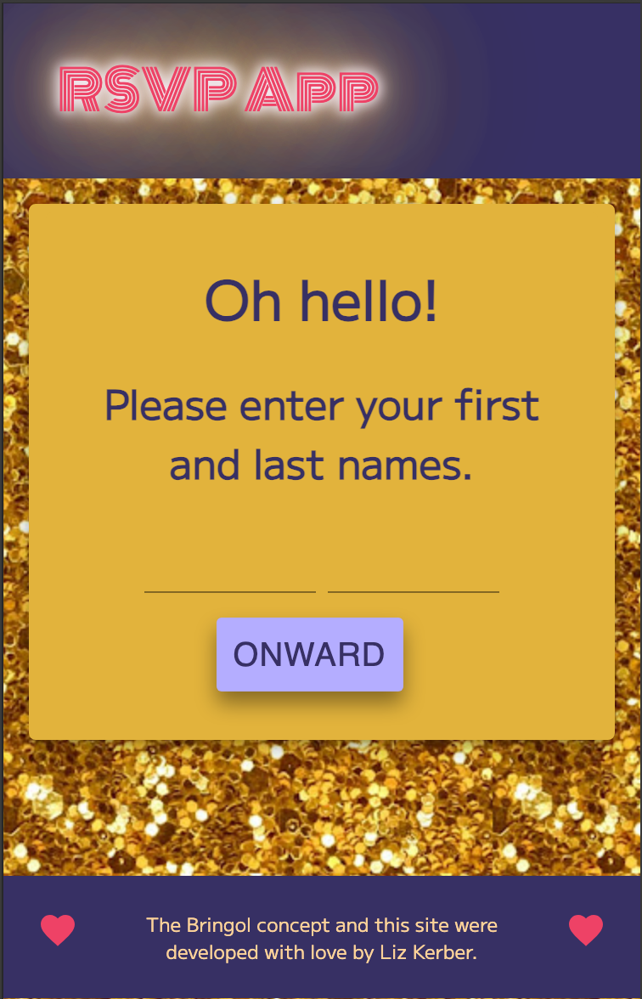

Register view for guest:
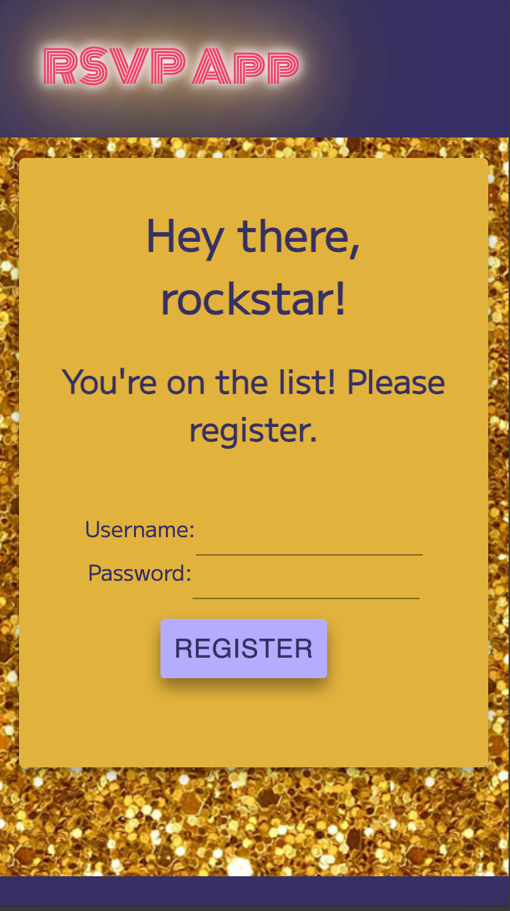

Login view for returning guest:
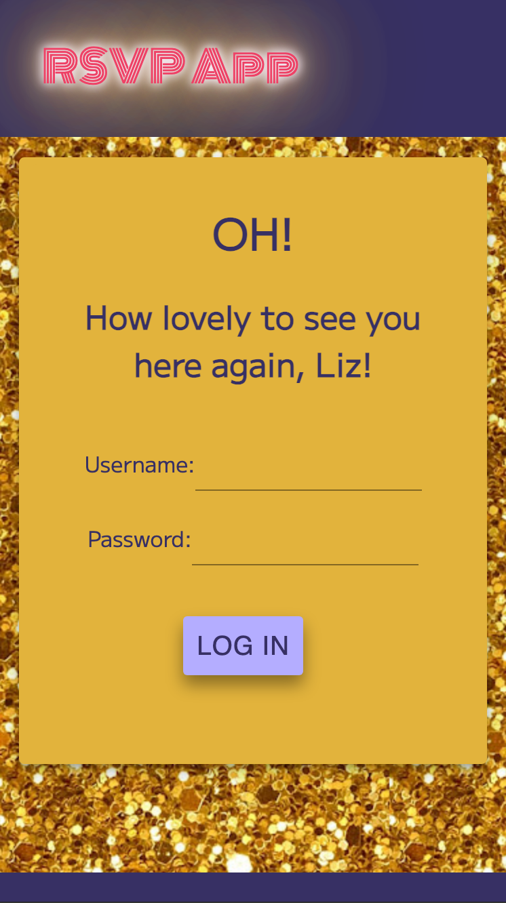

Event details view and guest nav:
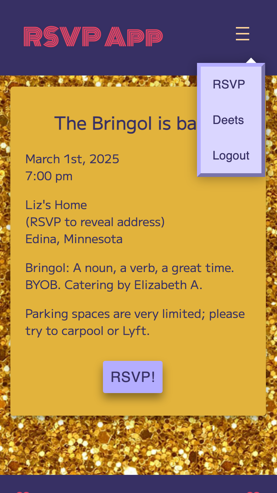

RSVP form:
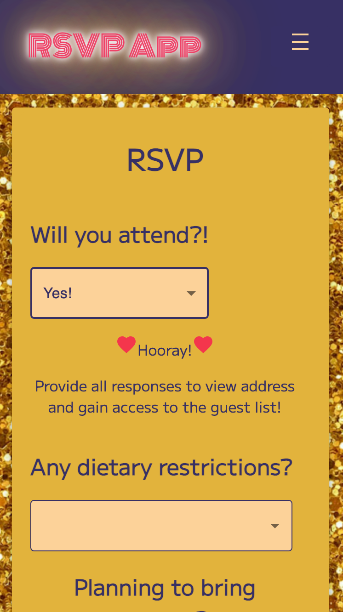

## Admin Views

Guests overview:

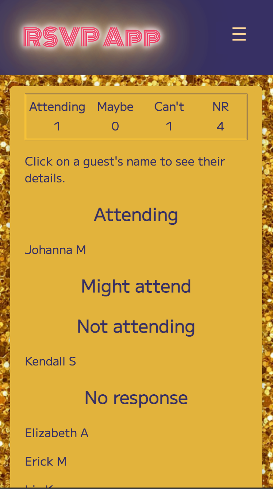

Guest details:

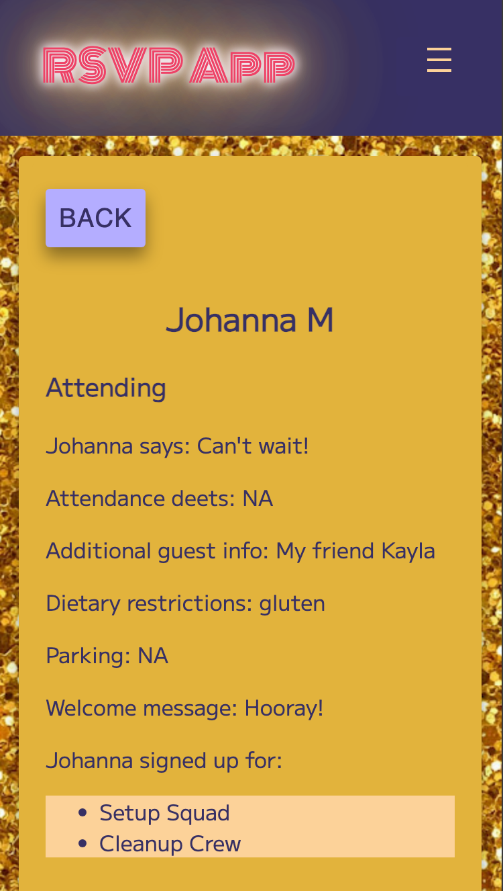

Responses overview:

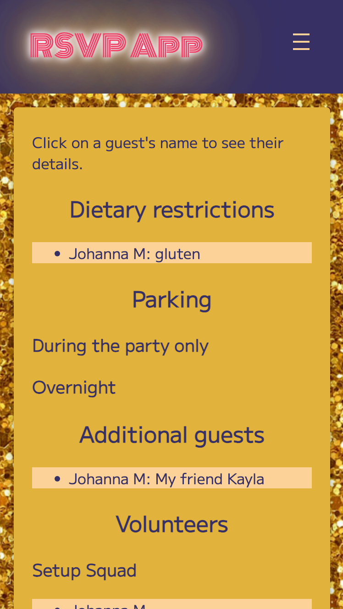

New guest and new definitely-not-invited forms:

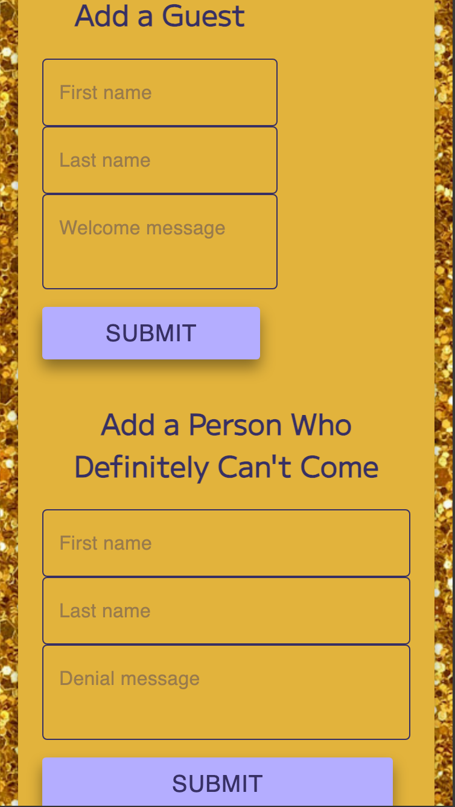

Form to approve/deny potential guests:

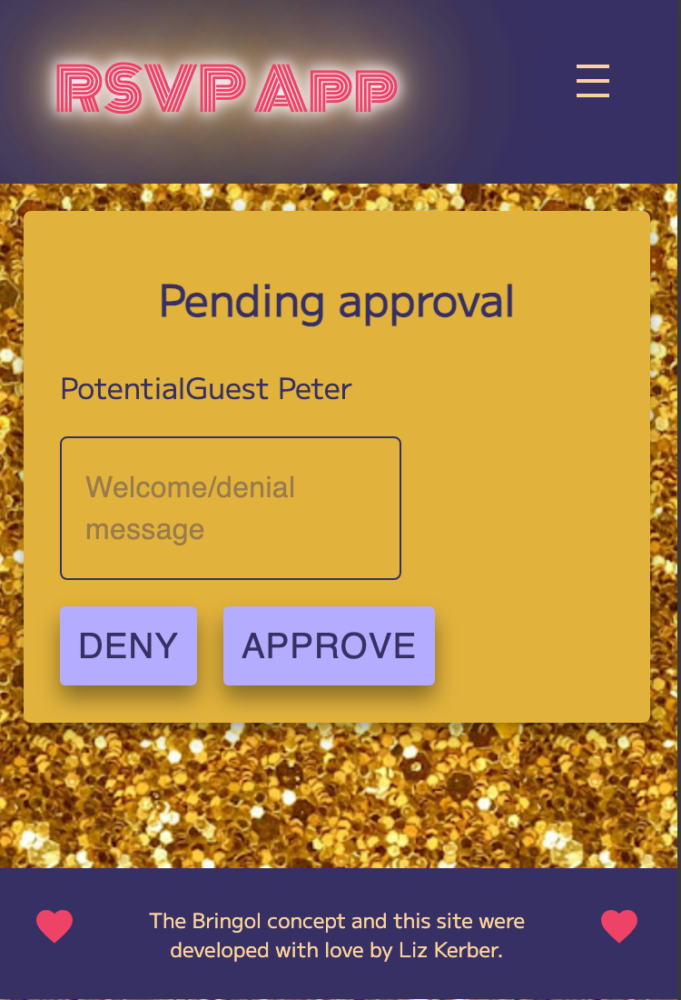

Admin nav:

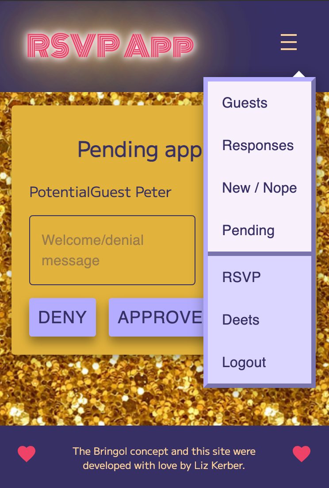